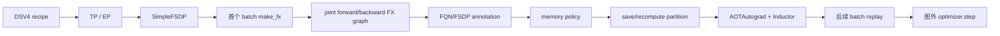
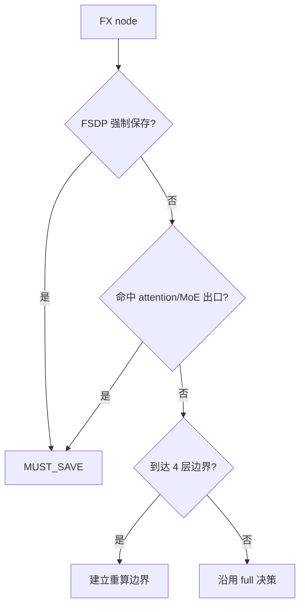

# DeepSeek-V4 GraphTrainer 激活重计算

本文说明 `torchtitan-npu` 中 DeepSeek-V4 GraphTrainer 的激活重计算设计，包括默认 `full` 策略、可选 `dsv4-mhc` 策略、使用方式和已知限制。


## 1. 特性概述

DeepSeek-V4 同时包含 attention、压缩 attention、MoE、SimpleFSDP 通信和 Ascend 融合算子。若前向激活全部保存，显存峰值较高；若只在 module 边界统一 checkpoint，又会重算昂贵的 attention/MoE 子图。GraphTrainer 先将前向、loss 和 `torch.autograd.grad` 反向捕获为联合 FX 图，再按节点决定保存或重算，从而用计算换取显存。

当前重计算只作用于联合前向/反向图，`optimizer.step()`、梯度裁剪和 scheduler 仍在图外执行。

核心原则：

- 在 joint FX graph 上做节点级决策，而不是重新包 eager checkpoint hook；
- 随机数状态、反向必需值和 FSDP 强制节点优先保存；
- 可重算子图保持函数式、无隐式状态；
- 通用策略由上游提供，NPU 仓只扩展 DSV4 所需规则。

## 2. 配置接口

### 2.1 默认配置

DSV4 GraphTrainer 工厂默认配置如下：

```text
enable = true
mode = "aot_fx_trace"
memory_policy = "full"
disable_passes = ["cudagraph_pass"]
```

配置位置：

```text
torchtitan_npu/models/deepseek_v4/config_registry.py
```

五个 GraphTrainer recipe 均使用 `num_mtp_layers=0` 和 `memory_policy="full"`。

### 2.2 切换 DSV4 专用策略

```bash
--compile.memory-policy dsv4-mhc
```

`dsv4-mhc` 不是默认策略。建议先用 `full` 完成数值和编译验证，再在相同模型、batch、并行度和 step 数下对比显存与吞吐。

### 2.3 配置类型要求

NPU ConfigManager 会跳过 `GraphTrainer.Config` 的普通包装，相关代码位于：

```text
torchtitan_npu/config/manager.py
```

如果误转成普通 `TrainerConfig`，训练会退回 `TrainerEx`，GraphTrainer 的联合图和重计算策略不会生效。

## 3. 执行流程



首个 batch 完成 trace、重计算分区和编译后，GraphTrainer 会缓存 TracedResult。后续 batch 复用已捕获的图和重计算策略，只更新实时输入、参数和 metadata。
后续 batch 必须满足首次捕获时的输入契约：
- pytree/input 结构保持不变；
- dtype、device 和未标记的静态 shape 保持不变；
- ratio 集合、metadata 字段结构和模块结构保持不变；
- 只有预先标记为 dynamic 且满足约束的维度可以变化。
当前 replay 路径不会因为输入契约变化而自动重新 trace。契约变化会导致 guard/replay 失效，必须显式重新捕获和编译；

## 4. 重计算实现

### 4.1 上游 `full` 策略

上游 full policy 默认使用一层一保存输出的策略，其余节点默认使用重计算方式。

代码位置：

```text
torchtitan/experiments/graph_trainer/memory_policy.py
```


### 4.2 NPU 策略框架

```text
torchtitan_npu/patches/torchtitan/graph_trainer/memory_policy.py
```

NPU 扩展使用 `NodePolicyKey` 按 FX target、模块 FQN 和 occurrence 定位节点，并提供 layer boundary、`MUST_SAVE`、反向节点跳过、`lm_head/loss` 跳过和 SymInt 保存等规则。

### 4.3 `dsv4-mhc` 策略

```text
torchtitan_npu/models/deepseek_v4/memory_policy.py
```

该策略以 `full` 为基线，主要做四件事：

1. 保存 `layers.*.attention.wo_b` 中第一次出现的 `aten.matmul.default`，避免重算昂贵的 attention 出口；
2. 保存 `layers.*.moe` 中第一次出现的 `aten.add.Tensor`，避免重算 MoE 输出合并；
3. 保留 `reshard_after_forward=False` 时的 FSDP 强制节点；
4. 每 4 层设置一个边界，让较便宜的 MHC 路径处于可重算分区中。

整体来说，除了保存跨层输出，还同步保存了每个mhc的post模块的输入，保障前面的gmm2等不会进入重计算，以此提升性能



它的权衡是保存少量高成本出口，重算低成本节点，以降低显存并控制反向计算开销。规则依赖 FQN、算子 target 和 occurrence，模型重构后可能静默失配。


## 5. 支持边界与风险
- `dsv4-mhc` 依赖 FQN、FX target 和 occurrence，模型或编译器升级后必须检查规则命中数。
- 重计算链路依赖 FX tracer、AOTAutograd、Dynamo dynamic annotation 和 Inductor 私有 API，升级 PyTorch、torch-npu 或 TorchTitan 后需重新回归。

## 6. 关键文件

| 功能 | 文件 |
| --- | --- |
| DSV4 GraphTrainer 配置 | `torchtitan_npu/models/deepseek_v4/config_registry.py` |
| 通用 full policy | `torchtitan/experiments/graph_trainer/memory_policy.py` |
| NPU policy 框架 | `torchtitan_npu/patches/torchtitan/graph_trainer/memory_policy.py` |
| `dsv4-mhc` 策略 | `torchtitan_npu/models/deepseek_v4/memory_policy.py` |
| FX tracer/replay | `torchtitan/experiments/graph_trainer/make_fx_tracer.py`、`torchtitan/experiments/graph_trainer/trainer.py` |
| SimpleFSDP | `torchtitan/experiments/graph_trainer/simple_fsdp.py` |
| 函数式 compressor | `torchtitan_npu/models/deepseek_v4/compressor.py` |
| RoPE compiler pattern | `torchtitan_npu/compile/patterns/common/partial_interleaved_rope.py` |
| 重算单测 | `tests/unit_tests/compile/patterns/deepseek_v4/test_recompute_policy.py` |

## 7. 结论

DeepSeek-V4 GraphTrainer 重计算是在联合 FX 图上进行节点级 save/recompute 决策，并与 SimpleFSDP 参数通信协同。`full` 是显存优先的通用基线，`dsv4-mhc` 保存 attention/MoE 高成本出口以减少部分重算。实际启用前应同时验证数值、峰值显存、重编译次数和稳态吞吐；不能只以训练成功启动作为结论。
